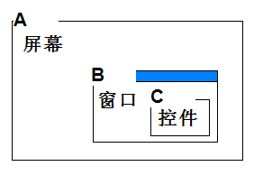

## View的坐标获取方法（红色线代表View方法的返回值含义)：
* getTop()：获取view自身顶边到父布局顶边的距离

* getBottom():获取View自身底边到父布局顶边的距离

* getLeft()：获取View自身左边到父布局左边的距离

* getRight():获取View自身右边到父布局左边的距离
* getWidth()和getHeight() 是获取view自身的宽和高
## MotionEvent提供的方法(蓝色线代表是MotionEvent方法获得的值):
* getX(): 获取点击事件距离该View左边的距离

* getY(): 获取点击事件距离该View顶边的距离

* getRawX(): 获取点击事件距离整个屏幕的左边的距离，绝对坐标

* getRawY(): 获取点击事件距离整个屏幕的顶边的距离，绝对坐标(包括通知栏的高度)
### 图示：

### 测试代码：
### Activity 需要去掉Activity状态栏和ActionBar的高度
* marginXX和pandingXX的效果
* ViewGroup效果
```
 android:theme="@style/Theme.AppCompat.Light.NoActionBar"
```
```java
//取消状态栏
getWindow().setFlags(WindowManager.LayoutParams.FLAG_FULLSCREEN,
                WindowManager.LayoutParams.FLAG_FULLSCREEN);
```
```java
public class CoordinateView extends View {
    //设置view的默认宽和高，在重写onMeasure中用到
    //注意哦  我们view的宽高设置的都是 30px
    private int defaultWidth = 100;
    private int defaultHeight = 100;
    Paint p = new Paint();

    public CoordinateView(Context context) {
        super(context);
    }

    public CoordinateView(Context context, AttributeSet attrs) {
        super(context, attrs);
        logCoordinate("CoordinateView+attrs");
    }

    public CoordinateView(Context context, AttributeSet attrs, int defStyleAttr) {
        super(context, attrs, defStyleAttr);
      logCoordinate("CoordinateView+attrs+defStyleAttr");

    }
    private void logCoordinate(String method){
        Log.e(method,"start");
        Log.e("getTop",getTop()+"");
        Log.e("getBottom",getBottom()+"");
        Log.e("getLeft",getLeft()+"");
        Log.e("getRight",getRight()+"");
        Log.e("getWidth",getWidth()+"");
        Log.e("getHeight",getHeight()+"");
        Log.e(method,"end");
    }
    /**
     * 重写onDraw方法
     * 以控件中心点为中心，宽度的一半为半径画一个红色的圆
     */
    @Override
    protected void onDraw(Canvas canvas) {
        super.onDraw(canvas);
        p.setColor(Color.RED);
        int x = this.getLeft() + this.getWidth()/2;
        int y = this.getTop() + this.getHeight()/2;
        canvas.drawCircle(this.getWidth()/2, this.getHeight()/2, this.getWidth()/2, p);
       logCoordinate("onDraw");
    }

    @Override
    public boolean onTouchEvent(MotionEvent event) {
        switch(event.getAction()){
            case MotionEvent.ACTION_DOWN:
                Log.e("MotionEvent.getX()",""+event.getX());
                Log.e("MotionEvent.getY()",""+event.getY());
                Log.e("MotionEvent.getRawX()",""+event.getRawX());
                Log.e("MotionEvent.getRawY()",""+event.getRawY());
                break;
        }
        return true;
    }
```
```
07-19 10:22:29.311 31123-31123/com.hiquanta.customview E/CoordinateView+attrs: start
07-19 10:22:29.312 31123-31123/com.hiquanta.customview E/getTop: 0
07-19 10:22:29.312 31123-31123/com.hiquanta.customview E/getBottom: 0
07-19 10:22:29.312 31123-31123/com.hiquanta.customview E/getLeft: 0
07-19 10:22:29.312 31123-31123/com.hiquanta.customview E/getRight: 0
07-19 10:22:29.312 31123-31123/com.hiquanta.customview E/getWidth: 0
07-19 10:22:29.312 31123-31123/com.hiquanta.customview E/getHeight: 0
07-19 10:22:29.312 31123-31123/com.hiquanta.customview E/CoordinateView+attrs: end
...
07-19 10:22:29.623 31123-31123/com.hiquanta.customview E/onDraw: start
07-19 10:22:29.623 31123-31123/com.hiquanta.customview E/getTop: 0
07-19 10:22:29.623 31123-31123/com.hiquanta.customview E/getBottom: 1800
07-19 10:22:29.623 31123-31123/com.hiquanta.customview E/getLeft: 0
07-19 10:22:29.623 31123-31123/com.hiquanta.customview E/getRight: 1080
07-19 10:22:29.623 31123-31123/com.hiquanta.customview E/getWidth: 1080
07-19 10:22:29.623 31123-31123/com.hiquanta.customview E/getHeight: 1800
07-19 10:22:29.623 31123-31123/com.hiquanta.customview E/onDraw: end
```
### 点击
```
07-19 10:23:54.770 31123-31123/com.hiquanta.customview E/MotionEvent.getX(): 408.5393
07-19 10:23:54.770 31123-31123/com.hiquanta.customview E/MotionEvent.getY(): 906.0948
07-19 10:23:54.770 31123-31123/com.hiquanta.customview E/MotionEvent.getRawX(): 408.5393
07-19 10:23:54.770 31123-31123/com.hiquanta.customview E/MotionEvent.getRawY(): 906.0948
```

## 获取view位置的方法

* 黑色边框 代表的是整个手机屏幕

* 绿色边框  代表的是状态栏

* 蓝色边框  代表的是App

* 红色边框  代表的是App 默认的 TitleBar

* 橙色边框  代表的是View
getLocationInWindow和getLocationOnScreen的区别

