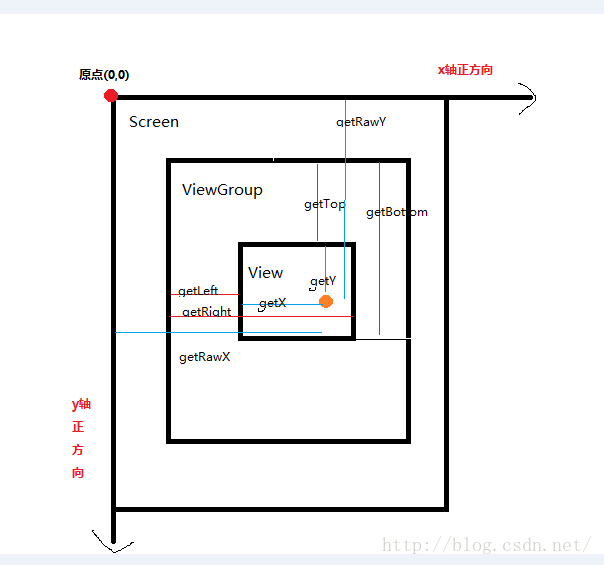
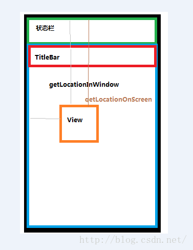
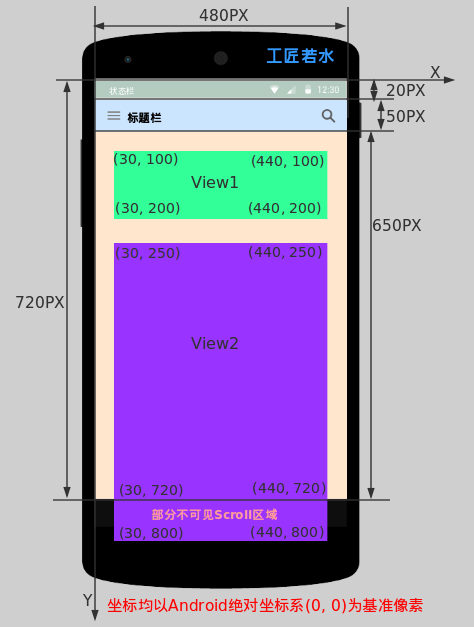
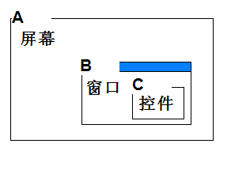

## View的坐标获取方法（红色线代表View方法的返回值含义)：
* getTop()：获取view自身顶边到父布局顶边的距离

* getBottom():获取View自身底边到父布局顶边的距离

* getLeft()：获取View自身左边到父布局左边的距离

* getRight():获取View自身右边到父布局左边的距离
* getWidth()和getHeight() 是获取view自身的宽和高
## MotionEvent提供的方法(蓝色线代表是MotionEvent方法获得的值):
* getX(): 获取点击事件距离该View左边的距离(返回值为getLeft()+getTranslationX()，当setTranslationX()时getLeft()不变，getX()变。)

* getY(): 获取点击事件距离该View顶边的距离(返回值为getTop()+getTranslationY()，当setTranslationY()时getTop()不变，getY()变。)

* getRawX(): 获取点击事件距离整个屏幕的左边的距离，绝对坐标

* getRawY(): 获取点击事件距离整个屏幕的顶边的距离，绝对坐标(包括通知栏的高度)
* getMeasuredWidth():返回measure过程得到的mMeasuredWidth值，供layout参考，或许没用。
* getMeasuredHeight():返回measure过程得到的mMeasuredHeight值，供layout参考，或许没用。
### 图示：

### 测试代码：
### Activity 需要去掉Activity状态栏和ActionBar的高度
* marginXX和pandingXX的效果
* ViewGroup效果
```
 android:theme="@style/Theme.AppCompat.Light.NoActionBar"
```
```java
//取消状态栏
getWindow().setFlags(WindowManager.LayoutParams.FLAG_FULLSCREEN,
                WindowManager.LayoutParams.FLAG_FULLSCREEN);
```
```java
public class CoordinateView extends View {
    //设置view的默认宽和高，在重写onMeasure中用到
    //注意哦  我们view的宽高设置的都是 30px
    private int defaultWidth = 100;
    private int defaultHeight = 100;
    Paint p = new Paint();

    public CoordinateView(Context context) {
        super(context);
    }

    public CoordinateView(Context context, AttributeSet attrs) {
        super(context, attrs);
        logCoordinate("CoordinateView+attrs");
    }

    public CoordinateView(Context context, AttributeSet attrs, int defStyleAttr) {
        super(context, attrs, defStyleAttr);
      logCoordinate("CoordinateView+attrs+defStyleAttr");

    }
    private void logCoordinate(String method){
        Log.e(method,"start");
        Log.e("getTop",getTop()+"");
        Log.e("getBottom",getBottom()+"");
        Log.e("getLeft",getLeft()+"");
        Log.e("getRight",getRight()+"");
        Log.e("getWidth",getWidth()+"");
        Log.e("getHeight",getHeight()+"");
        Log.e(method,"end");
    }
    /**
     * 重写onDraw方法
     * 以控件中心点为中心，宽度的一半为半径画一个红色的圆
     */
    @Override
    protected void onDraw(Canvas canvas) {
        super.onDraw(canvas);
        p.setColor(Color.RED);
        int x = this.getLeft() + this.getWidth()/2;
        int y = this.getTop() + this.getHeight()/2;
        canvas.drawCircle(this.getWidth()/2, this.getHeight()/2, this.getWidth()/2, p);
       logCoordinate("onDraw");
    }

    @Override
    public boolean onTouchEvent(MotionEvent event) {
        switch(event.getAction()){
            case MotionEvent.ACTION_DOWN:
                Log.e("MotionEvent.getX()",""+event.getX());
                Log.e("MotionEvent.getY()",""+event.getY());
                Log.e("MotionEvent.getRawX()",""+event.getRawX());
                Log.e("MotionEvent.getRawY()",""+event.getRawY());
                break;
        }
        return true;
    }
```
```
07-19 10:22:29.311 31123-31123/com.hiquanta.customview E/CoordinateView+attrs: start
07-19 10:22:29.312 31123-31123/com.hiquanta.customview E/getTop: 0
07-19 10:22:29.312 31123-31123/com.hiquanta.customview E/getBottom: 0
07-19 10:22:29.312 31123-31123/com.hiquanta.customview E/getLeft: 0
07-19 10:22:29.312 31123-31123/com.hiquanta.customview E/getRight: 0
07-19 10:22:29.312 31123-31123/com.hiquanta.customview E/getWidth: 0
07-19 10:22:29.312 31123-31123/com.hiquanta.customview E/getHeight: 0
07-19 10:22:29.312 31123-31123/com.hiquanta.customview E/CoordinateView+attrs: end
...
07-19 10:22:29.623 31123-31123/com.hiquanta.customview E/onDraw: start
07-19 10:22:29.623 31123-31123/com.hiquanta.customview E/getTop: 0
07-19 10:22:29.623 31123-31123/com.hiquanta.customview E/getBottom: 1800
07-19 10:22:29.623 31123-31123/com.hiquanta.customview E/getLeft: 0
07-19 10:22:29.623 31123-31123/com.hiquanta.customview E/getRight: 1080
07-19 10:22:29.623 31123-31123/com.hiquanta.customview E/getWidth: 1080
07-19 10:22:29.623 31123-31123/com.hiquanta.customview E/getHeight: 1800
07-19 10:22:29.623 31123-31123/com.hiquanta.customview E/onDraw: end
```
### 点击
```
07-19 10:23:54.770 31123-31123/com.hiquanta.customview E/MotionEvent.getX(): 408.5393
07-19 10:23:54.770 31123-31123/com.hiquanta.customview E/MotionEvent.getY(): 906.0948
07-19 10:23:54.770 31123-31123/com.hiquanta.customview E/MotionEvent.getRawX(): 408.5393
07-19 10:23:54.770 31123-31123/com.hiquanta.customview E/MotionEvent.getRawY(): 906.0948
```

## 获取view位置的方法

* 黑色边框 代表的是整个手机屏幕

* 绿色边框  代表的是状态栏

* 蓝色边框  代表的是App

* 红色边框  代表的是App 默认的 TitleBar

* 橙色边框  代表的是View


通过上图我们可以很直观的看到Android对于屏幕的划分定义。下面我们就给出这些区域里常用区域的一些坐标或者度量方式。如下：
### 获取屏幕区域的宽高等尺寸获取
```java
DisplayMetrics metrics = new DisplayMetrics();
getWindowManager().getDefaultDisplay().getMetrics(metrics);
int widthPixels = metrics.widthPixels;
int heightPixels = metrics.heightPixels;
```
### 应用程序App区域宽高等尺寸获取
```java
Rect rect = new Rect();
getWindow().getDecorView().getWindowVisibleDisplayFrame(rect);
```
### 获取状态栏高度
```java
Rect rect= new Rect();
getWindow().getDecorView().getWindowVisibleDisplayFrame(rect);
int statusBarHeight = rectangle.top;
```
### View布局区域宽高等尺寸获取
```java
Rect rect = new Rect();  
getWindow().findViewById(Window.ID_ANDROID_CONTENT).getDrawingRect(rect);  
```
## View获取屏幕中位置的方法


| View宽高方法     | 上图View1结果     |上图View2结果     |结论描述    |
| :------------- | :------------- |:------------- |:------------- |
| getLocalVisibleRect()       | (0, 0 - 410, 100)       | (0, 0 - 410, 470)       | 获取View自身可见的坐标区域，坐标以自己的左上角为原点(0,0)，另一点为可见区域右下角相对自己(0,0)点的坐标，其实View2当前height为550，可见height为470。       |
| getGlobalVisibleRect()       | (30, 100 - 440, 200)      | (30, 250 - 440, 720)       | 获取View在屏幕绝对坐标系中的可视区域，坐标以屏幕左上角为原点(0,0)，另一个点为可见区域右下角相对屏幕原点(0,0)点的坐标。       |
| getLocationOnScreen()      | (30, 100)       | (30, 250)       | 坐标是相对整个屏幕而言，Y坐标为View左上角到屏幕顶部的距离。       |
| getLocationInWindow()       | (30, 100)       | (30, 250)       | 如果为普通Activity则Y坐标为View左上角到屏幕顶部（此时Window与屏幕一样大）；如果为对话框式的Activity则Y坐标为当前Dialog模式Activity的标题栏顶部到View左上角的距离。       |

getLocationInWindow和getLocationOnScreen的区别


## View滑动相关方法
| View的滑动方法    | 效果及描述     |
| :------------- | :------------- |
| offsetLeftAndRight(int offset)       | 水平方向挪动View，offset为正则x轴正向移动，移动的是整个View，getLeft()会变的，自定义View很有用。       |
| offsetTopAndBottom(int offset)       | 垂直方向挪动View，offset为正则y轴正向移动，移动的是整个View，getTop()会变的，自定义View很有用。       |
| scrollTo(int x, int y)       | 将View中内容（不是整个View）滑动到相应的位置，参考坐标原点为ParentView左上角，x，y为正则向xy轴反方向移动，反之同理。       |
| scrollBy(int x, int y)       | 在scrollTo()的基础上继续滑动xy。       |
| setScrollX(int value)       | 实质为scrollTo()，只是只改变Y轴滑动。       |
| setScrollY(int value)       | 实质为scrollTo()，只是只改变X轴滑动。       |
| getScrollX()/getScrollY()       | 获取当前滑动位置偏移量。       |

关于Android View的scrollBy()和scrollTo()参数传递正数却向坐标系负方向移动的特性可能很多人都有疑惑，甚至是死记结论，这里我们简单给出产生这种特性的真实原因—-源码分析，如下：
```java
public void scrollTo(int x, int y) {
    if (mScrollX != x || mScrollY != y) {
        int oldX = mScrollX;
        int oldY = mScrollY;
        mScrollX = x;
        mScrollY = y;
        invalidateParentCaches();
        onScrollChanged(mScrollX, mScrollY, oldX, oldY);
        if (!awakenScrollBars()) {
        postInvalidateOnAnimation();
        }
    }
}
```
View的该方法注释里明确说明了调运他会触发onScrollChanged()和invalidated()方法，那我们就将矛头转向invalidated()方法触发的draw()过程，draw()过程中最终其实会触发下面的invalidate()方法，如下：
```
public void invalidate(int l, int t, int r, int b) {
    final int scrollX = mScrollX;
    final int scrollY = mScrollY;
    //scroller时为何参数和坐标反向的真实原因
    invalidateInternal(l - scrollX, t - scrollY, r - scrollX, b - scrollY, true, false);
}
```
scrollTo()和scrollBy()方法特别注意：如果你给一个ViewGroup调用scrollTo()方法滚动的是ViewGroup里面的内容，如果想滚动一个ViewGroup则再给他嵌套一个外层，滚动外层即可。


## 相关文章
[Android应用坐标系统全面详解](http://blog.csdn.net/yanbober/article/details/50419117)

[Android 屏幕（View）坐标系统](http://blog.csdn.net/wangjinyu501/article/details/21827341)

[安卓自定义View基础：坐标系](http://android.jobbole.com/83276/)
