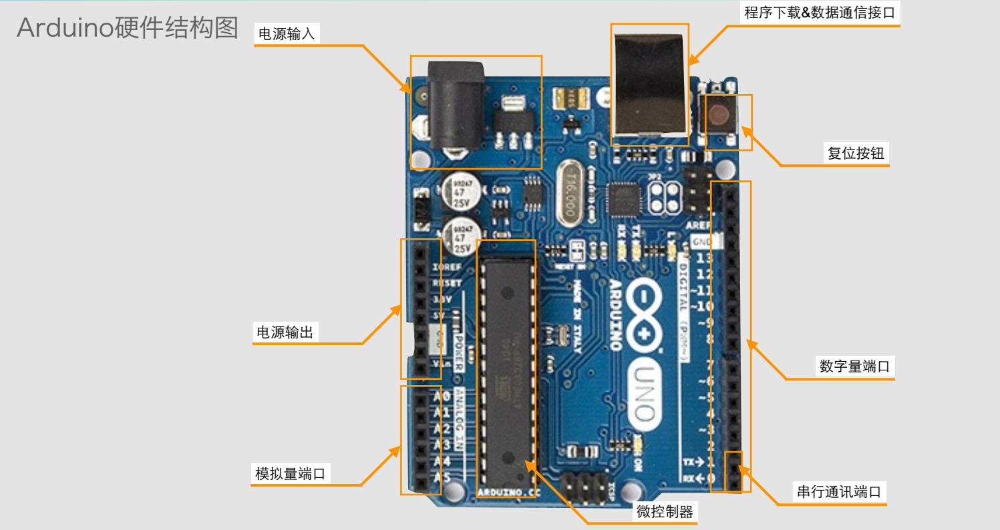
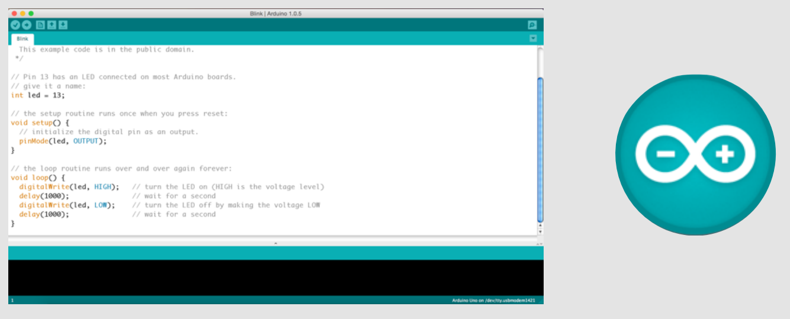

## [介绍](http://baike.baidu.com/link?url=F8-iGnUjNpmRYoHfg4PRL8fcIYyopRFtrGSHrL5hfmV1E5gDMpBBANRfAFYkqle8IZKaIESvEWktTmO7lSGnz_)
[官网](https://www.arduino.cc/)
## 型号
* Arduino Uno
* Arduino Nano
* Arduino Nano
* Arduino Nano
* Arduino LilyPad
* Arduino Mega 2560
* Arduino Ethernet
* Arduino Due
* Arduino Leonardo
* ArduinoYún

## 硬件结构

* 模拟量端口
* 数字两端口
* 串口通信端口
* 微控制器
* 电源输出接口
* 程序下载通讯接口
* 复位按钮

## Windows开发环境搭建
### 界面：

* 下载
https://www.arduino.cc
* 驱动
* Fritzing的安装 http://fritzing.org/
