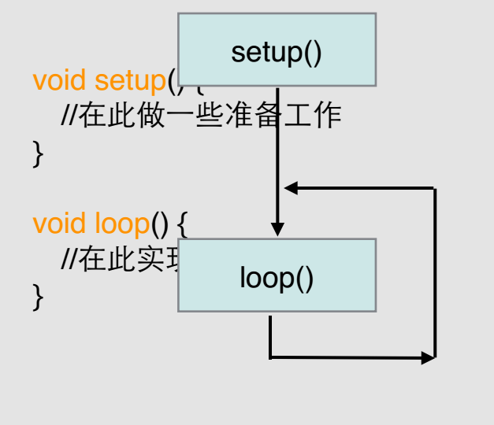

<!--more-->
* LED的使用
* LED点阵的使用
* LEDRGB的使用

## LED原理
  LED是会发光的二极管，它具有单向导电性，两边加电压，即将电能转化为光能
### 需知
  * 如何区分正负极
  * 应在那一极加电阻
## 数字电平:电压的另一种解读方式

## Arduino的数字端口

## LED的使用


> [面包板的使用方法]()

## Arduino程序的一般结构

### 代码
```c
int led=8;
void setup()
{
  pinMode(led,OUTPUT);
}
void loop()
{
  digitalWrite(led,HIGH);
  delay(100);
  digitalWrite(led,LOW);
  delay(100);
}
```
## 使用到的库函数

***
## LED点阵的使用

## 原理

## LED点阵图形原理

## 计算机显示字符的原理

## 如何在Arduino程序中储存字库

### 显示的字形

